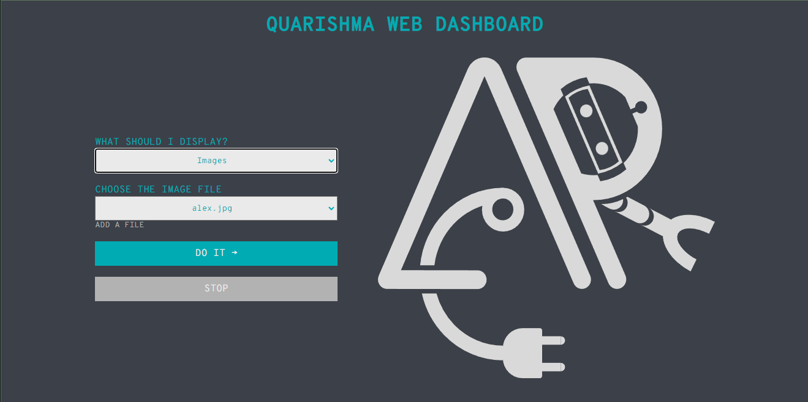

<br/>
<p align="center">
  <a href="https://github.com/Crian69/QuarishmaDashboard">
    
  </a>

  <h3 align="center">Quarishma Display Dashboard</h3>

  <p align="center">
    Web Dashboard To Control The Content On Display Of Quarishma
    <br/>
    <br/>
  </p>
</p>

   

## About The Project



The dashboard uses flask as the backend and for the web to run the tkinter scripts to play different type of media on the display.

It is not easy playing different type of media using web to a raspberry pi so I have created different scripts to play image, video and sound and use subprocesses to run them as process when form is submitted from the dashboard based on selected option from user flask runs script of selected media type

## Built With

- [Flask](https://flask.palletsprojects.com/en/2.2.x/)
- [tkinter](https://docs.python.org/3/library/tkinter.html)
- [python-opencv](https://opencv.org/)
- [pillow](https://pypi.org/project/Pillow/)


### Prerequisites

project dependencies with pip

```sh
pip install -r requirements.txt
```

## Usage

Simply run the _main.py_ to start the flask server and get things working

## License

Distributed under the MIT License. See [LICENSE](https://github.com/Crian69/QuarishmaDashboard/blob/main/LICENSE.md) for more information.

## Authors

- [Chirayu Prasai](https://github.com/Crian69) 
